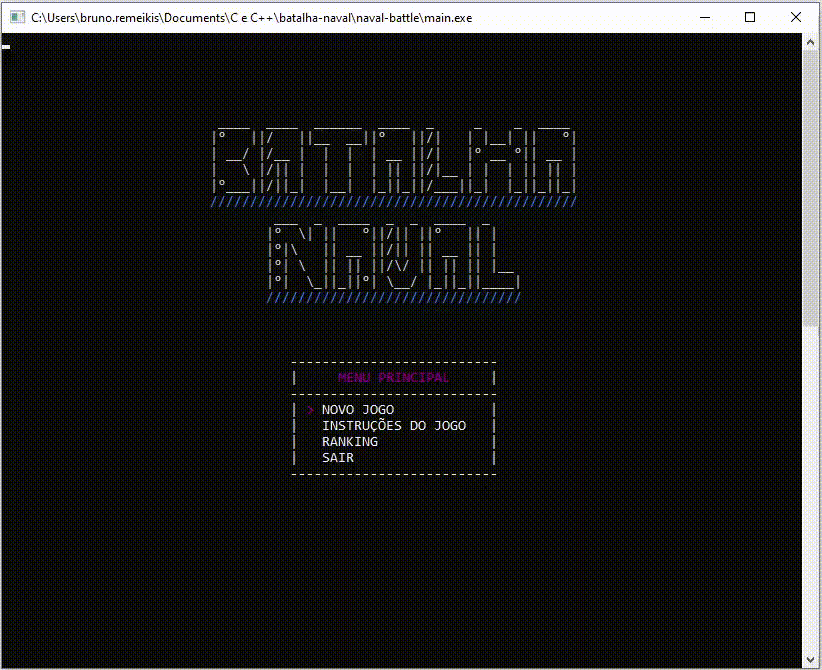
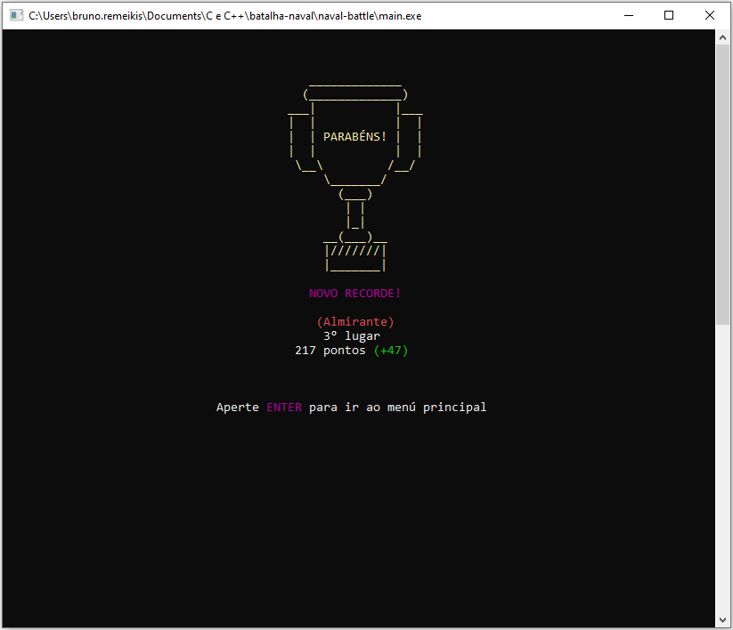
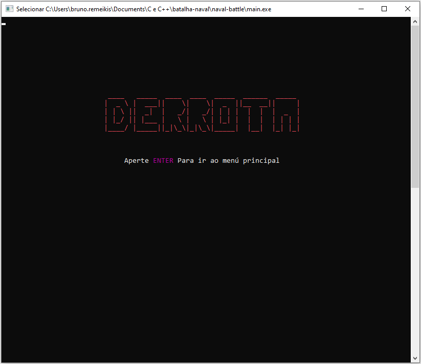

# Naval Battle
A c++ naval battle that runs at the command prompt.

## Features
- Conio2 - A lib that allows you to change the color of the prompt and reposition the cursor

## Getting started
1. Clone this repo using `git clone https://github.com/bruno-remeikis/naval-battle.git`
2. Compile the `main.cpp` file

## Demonstration
- Basic flow

 

- Victory view

 

- Defeat view

